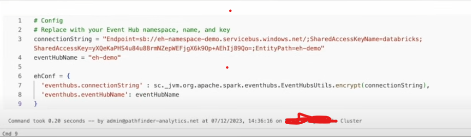

# Real-Time-Streaming-with-Azure-Databricks-and-Event-Hubs-using-JSON-format
we are creating real time data in Azure Event Hubs and then store and process the data in our Databricks Lakehouse, implementing the Bronze, Silver, and Gold layers of the Medallion Architecture. The final step involves creating a near real-time report on Power BI, showcasing the power of streaming analytics

Prerequisites
1.Active Azure subscription with access to Azure Databricks and Event Hubs.

2.Databricks Workspace with Unity Catalog Enabled.

3.Azure Event Hubs Service.

4.Power BI Desktop (Windows).

5.Familiarity with Python, Spark, SQL, and basic data engineering concepts.

1.Data Sources: Streaming data from IoT devices or social media feeds. (Simulated in Event Hubs)

2.Ingestion: Azure Event Hubs for capturing real-time data.

3.Processing: Azure Databricks for stream processing using Structured Streaming.

4.Storage: Processed data stored Azure Data Lake (Delta Format).

5.Visualisation: Data visualized using Power BI.

process:

1.create an event bub namespace-event hub-shared access policy with listen permission

2.in event hub-features-generate data(preview)-copy the input  json data-send

3.lly change some values in json and give input as 2 to 3 inputs.

4.create databricks workspace and give compute settings

Single Node Compute Cluster: 12.2 LTS (includes Apache Spark 3.3.2, Scala 2.12)

Databricks Workspace (Unity Catalog enabled)

5.click on cluster-go to libraries-install new-maven-search packages -install

i.e,Maven Library installed on Compute Cluster: com.microsoft.azure:azure-eventhubs-spark_2.12:2.3.22

6.config set-up for event-hubs in databricks

7.checkpointLocation path is present in DBFS

8.if DBFS is not visible,then click on mail-advance-workspace-check dbfs is set on.

Bronze-silver Transformation

9.we can see the body is in string format

can be converted to readable format

converted into json object

